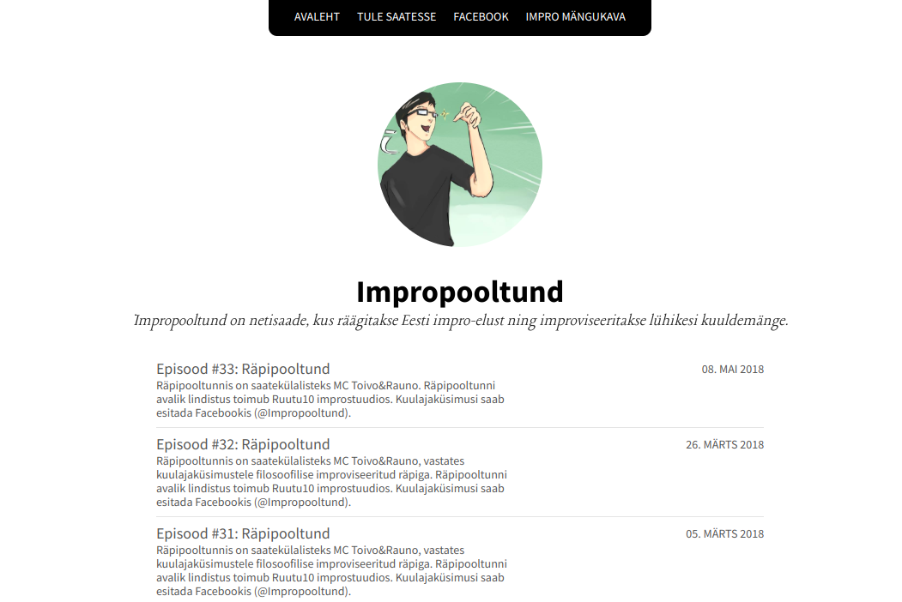

Most of my projects are public in GitHub:
[github.com/anroots](https://github.com/anroots).

## Impropooltund

[impropooltund.improv.ee](https://impropooltund.improv.ee) is a podcast about
improvised theatre in Estonia.

## Snarky Doorbell

http://localhost:4000/2017/snarky-doorbell

## Home Automation

https://github.com/anroots/mysensors

## improv.ee

## Tilt festival

## Home Lab

- https://github.com/anroots/huawei-4g-exporter
- https://github.com/anroots/shut-it
- https://github.com/anroots/jaa-ee
- https://github.com/anroots/girlfriend-puzzle
- https://github.com/anroots/hubot-fleep
- https://github.com/anroots/box-of-words